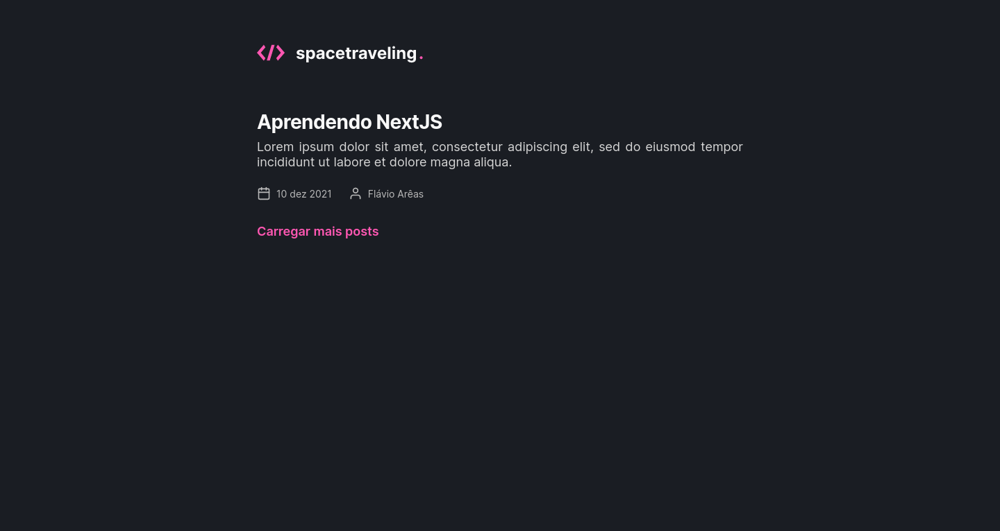
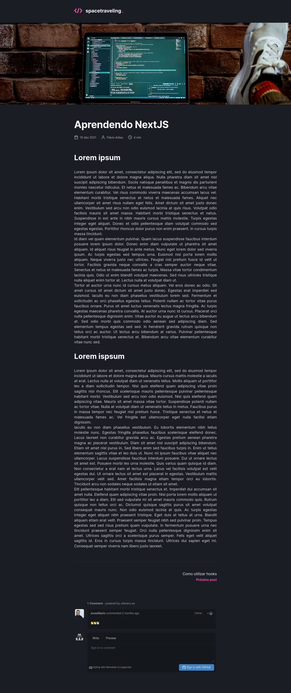

# reactjs-blog

<p align="center">
  
</p>

<h2 align="center">
  A blog application. Built with ReactJS, Next.JS, SASS, Prismic, Stripe and
  Typescript.
</h2>

<p align="center">
  

  

  <a href="https://github.com/areasflavio/reactjs-blog/commits/master">
    
  </a>
</p>

<p align="center">
  <a href="#star-features">Features</a>&nbsp;&nbsp;|&nbsp;&nbsp;
  <a href="#keyboard-technologies">Technologies</a>&nbsp;&nbsp;|&nbsp;&nbsp;
  <a href="#computer_mouse-installation">Installation</a>
</p>





<br/>

# :star: Features

[(Back to top)](#reactjs-blog)

This is a simple blog app. Publish your content to everyone.

Some key features are:

- Functional application with Next.JS with SSG.
- UI built with SASS.
- Integration with Prismic CMS, to work with every part of the blog system.
- Prismic CMS preview feature for unpublished posts.
- Comments connected with utterances.
- Many functionalities are cover by tests using Jest and Testing Library.

The application is built using ReactJS with Next.JS framework and SSG
features. Posts data is provided by Prismic CMS and the user. The user interface
is built with SASS. The entire codebase is written using Typescript.

> Project developed as a challenge for Chapter III of Rocketseat's Ignite bootcamp.

<p align="center">
  You can also check out the <a href="https://reactjs-blog-eight.vercel.app">full version</a>
  of the hosted application at:
</p>
<p align="center">
    
</p>

<br/>

# :keyboard: Technologies

[(Back to top)](#reactjs-blog)

This is what i used and learned with this project:

- [x] ReactJS
- [x] Next.JS
- [x] Prismic CMS
- [x] SASS
- [x] React Icons
- [x] Date FNS
- [x] utterances
- [x] Axios
- [x] Eslint
- [x] Prettier
- [x] Jest
- [x] Testing Library
- [x] Typescript

<br/>

# :computer_mouse: Installation

[(Back to top)](#reactjs-blog)

To use this project, first you need NodeJS running in your device, then you can
follow the commands below:

```bash
# Clone this repository
git clone https://github.com/areasflavio/reactjs-blog.git

# Go into the repository
cd reactjs-blog

# Install dependencies for the application
yarn install

# Copy the .env.example to the .env.local file and inject your credentials
cp .env.example .env.local

# To start the development server, run the following command
yarn dev
```

# :man_technologist: Author

[(Back to top)](#reactjs-blog)

Build by Flávio Arêas 👋 [Get in touch!](https://www.linkedin.com/in/areasflavio/)
